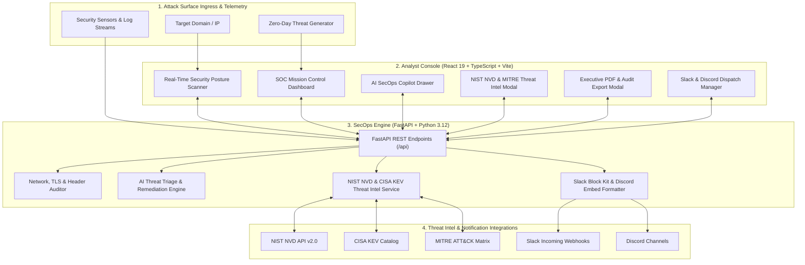

# 🛡️ AegisPulse AI — Autonomous SecOps & Threat Intelligence Platform

> **Next-Generation Attack Surface Management (ASM) & Autonomous AI Threat Triage Platform.**  
> Protect your infrastructure before threats become breaches. AegisPulse continuously scans external attack surfaces, correlates live NIST NVD CVEs, maps adversarial tactics to MITRE ATT&CK, broadcasts real-time Slack/Discord alerts, and generates 1-click executive audit dossiers & remediation playbooks.

<div align="center">

[](https://aegispulse-ai.vercel.app/)
[](https://github.com/sidetech311-hash/aegispulse-ai)
[](https://github.com/sidetech311-hash/aegispulse-ai/actions)
[](https://opensource.org/licenses/MIT)

[](https://python.org)
[](https://fastapi.tiangolo.com)
[](https://react.dev)
[](https://www.typescriptlang.org)
[](https://tailwindcss.com)
[](https://nvd.nist.gov)
[](https://attack.mitre.org)
[](https://www.cisa.gov/known-exploited-vulnerabilities-catalog)

</div>

---

## ⚡ Live Product Tour (No Setup Required)

Experience AegisPulse AI directly in your browser:  
🔗 **[https://aegispulse-ai.vercel.app/](https://aegispulse-ai.vercel.app/)**

1. **Attack Surface Scanner**: Enter any public domain (`github.com`, `cloudflare.com`, or your personal infrastructure) to audit TLS certificates, security headers (`HSTS`, `CSP`), and open ports with an instant 0–100 posture score.
2. **Live Mission Control SOC**: Inspect active telemetry alerts, toggle severity filters, click **"+ Simulate Threat"** to stream zero-day attacks, and manage monitored cloud VPS and API gateways.
3. **Autonomous AI Copilot**: Click any incident row to inspect CVSS 3.1 metrics, generate executive leadership briefs, and run 1-click remediation scripts in **Bash**, **PowerShell**, or **Cloudflare WAF**.
4. **Threat Intelligence & CVE Explorer**: Search any CVE (e.g. `CVE-2024-6387`, `CVE-2021-44228`, `CVE-2024-3094`) to view CVSS breakdown, CISA KEV active exploitation status, and MITRE ATT&CK matrix.
5. **Executive Audit Export**: Generate SOC 2 Type II, ISO 27001, and HIPAA compliant security reports with 1-click Save to PDF, Markdown, or JSON SIEM export.
6. **Discord & Slack Webhooks**: Configure incident webhooks, preview rich interactive embeds, and test live automated dispatch.

---

## 📌 High-Level Architecture



---

## 🚀 Key Feature Breakdown

### 1. 🔍 Zero-Agent External Attack Surface Scanner
- **Full-Spectrum Evaluation**: Inspects DNS records, TLS certificate chain validity, cipher strength, and expiration timelines.
- **Defensive Header Auditor**: Evaluates `Strict-Transport-Security` (HSTS), `Content-Security-Policy` (CSP), `X-Frame-Options`, `X-Content-Type-Options`, and `Referrer-Policy`.
- **Exposed Port Reconnaissance**: Audits critical service ports (`80`, `443`, `22`, `8080`) to catch exposed administrative interfaces before attackers scan them.
- **Dynamic Posture Scoring**: Computes an objective 0–100 Security Posture Score with letter grades (`A+` to `F`) and color-coded risk indicators.

### 2. ⚡ Live Mission Control SOC Console
- **Real-Time KPIs**: Monitors Posture Index, Active Threats, Mean Time to Containment (MTTC), and Monitored Cloud Assets.
- **Severity Stratification**: Color-coded badges for `CRITICAL`, `HIGH`, `MEDIUM`, and `LOW` vulnerabilities.
- **Simulate Threat Engine**: Injects real-world attack vectors (RegreSSHion SSH exploit, Log4Shell JNDI injection, XZ backdoor probes) for live SecOps drill exercises.
- **Infrastructure Inventory**: Manages monitored API gateways, cloud VPS instances, Kubernetes ingress nodes, and database clusters.

### 3. 🧠 Autonomous AI Threat Copilot
- **Executive Briefing Generator**: Automatically writes C-suite security memos detailing compromised scope, customer impact, downtime risk, and isolation status.
- **Attack Vector Root-Cause**: Pinpoints technical vulnerability vectors, exposed protocols, and CVSS severity metrics.
- **1-Click Remediation Playbooks**:
  - 🐧 **Bash**: Automated `iptables`, `ufw`, `fail2ban`, and daemon restart commands.
  - 🪟 **PowerShell**: Windows Firewall (`New-NetFirewallRule`) and service hardening scripts.
  - ☁️ **Cloudflare WAF**: Automated edge JSON firewall filter rules for perimeter mitigation.
- **Resolution Workflow**: 1-click status updates to mark threats as `RESOLVED`, `INVESTIGATING`, or `CONTAINED`.

### 4. 🌐 Live NIST NVD & MITRE ATT&CK Threat Intel
- **Live NVD API 2.0 Integration**: Resolves real-time vulnerability descriptions, CVSS v3.1 vector strings, and publication timelines.
- **CISA KEV Verification**: Highlights vulnerabilities actively exploited in the wild with mandatory patching deadlines.
- **MITRE ATT&CK Framework Mapping**: Correlates CVEs to adversarial tactics and techniques (e.g., *Initial Access: T1190*, *Privilege Escalation: T1068*, *Defense Evasion: T1556*).
- **Interactive Metrics Radar**: Visual gauges for Attack Vector, Attack Complexity, Privileges Required, User Interaction, Confidentiality, Integrity, and Availability.

### 5. 📄 Executive PDF & Compliance Audit Dossier
- **Audit Framework Alignment**: Generates reports formatted for **SOC 2 Type II (CC6.1, CC7.1)**, **ISO/IEC 27001:2022 (A.8.8)**, and **HIPAA Security Rule (§ 164.308)**.
- **Print & PDF Engine**: Custom `@media print` CSS rules format pristine executive PDFs directly from the browser without third-party watermarks.
- **Multi-Format Export**: One-click export to **Markdown** (for engineering wikis/Notion) and **JSON** (for SIEM ingestion into Splunk/Elastic).

### 6. 🔔 Real-Time Slack & Discord Alert Webhooks
- **Discord Rich Embeds**: Colored embed notifications with incident title, CVSS score, target IP, MITRE tag, and 1-click containment command.
- **Slack Block Kit**: Enterprise-formatted Slack alert cards with divider sections, fields, and direct links to the SOC incident console.
- **Instant Preview & Live Dispatch**: In-browser simulator to test webhook URLs before activating automated alerting.

---

## 🛠️ Monorepo Architecture

```text
aegispulse-ai/
├── frontend/                         # React 19 + TypeScript + Vite + Tailwind CSS v4
│   ├── src/
│   │   ├── components/
│   │   │   ├── AICopilotDrawer.tsx    # Autonomous AI SecOps triage drawer
│   │   │   ├── CVEDetailsModal.tsx    # NIST NVD & MITRE ATT&CK threat intelligence modal
│   │   │   ├── ExecutiveReportModal.tsx # SOC 2 / ISO 27001 print-to-PDF audit dossier
│   │   │   ├── WebhookModal.tsx       # Slack Block Kit & Discord Webhook manager
│   │   │   ├── SOCDashboard.tsx       # Mission control telemetry & incident table
│   │   │   ├── Scanner.tsx            # External attack surface audit widget
│   │   │   ├── Hero.tsx               # SaaS landing hero section
│   │   │   ├── Navbar.tsx             # Global navigation bar with integrations
│   │   │   └── Footer.tsx             # Compliance & copyright footer
│   │   ├── services/
│   │   │   └── api.ts                 # Full API client with browser-side fallback engine
│   │   ├── types/
│   │   │   └── index.ts               # Strict TypeScript schemas for all data models
│   │   ├── App.tsx                   # Main SPA controller
│   │   └── index.css                 # Tailwind v4 styles, custom glassmorphism & print CSS
│   ├── package.json
│   └── vite.config.ts
│
├── backend/                          # FastAPI + Python 3.12 enterprise microservice
│   ├── app/
│   │   ├── api/
│   │   │   └── endpoints.py           # REST endpoints (/scan, /incidents, /cve, /webhooks)
│   │   ├── database/
│   │   │   └── session.py             # SQLAlchemy sessionmaker & SQLite/Postgres engine
│   │   ├── models/
│   │   │   └── schemas.py             # Database models (Incident, Asset, ScanReport)
│   │   ├── schemas/                   # Pydantic validation schemas
│   │   ├── services/
│   │   │   ├── scanner.py             # Network TLS & defensive header probe engine
│   │   │   ├── ai_engine.py           # AI incident triage & remediation script generator
│   │   │   ├── threat_intel.py        # NIST NVD API 2.0 & MITRE ATT&CK service
│   │   │   └── webhook_service.py     # Slack Block Kit & Discord Embed dispatch engine
│   │   └── main.py                   # FastAPI application root & CORS middleware
│   ├── requirements.txt               # Pinned Python dependencies
│   └── Dockerfile                     # Multi-stage production container manifest
│
├── docker-compose.yml                # 1-Command full-stack container orchestration
├── start-all.ps1                     # Automated local Windows launcher
└── README.md                         # Comprehensive documentation & portfolio showcase
```

---

## 📡 REST API Reference

| Method | Endpoint | Description |
|---|---|---|
| `GET` | `/api/health` | Service health status and timestamp |
| `POST` | `/api/scan` | Audit domain network, TLS certificates, headers, and ports |
| `GET` | `/api/incidents` | Retrieve list of security incidents and active CVEs |
| `POST` | `/api/incidents` | Ingest new security telemetry alert |
| `PUT` | `/api/incidents/{id}/status` | Update incident status (`CONTAINED`, `RESOLVED`, `INVESTIGATING`) |
| `GET` | `/api/incidents/{id}/export` | Generate SOC 2 / ISO 27001 executive audit payload |
| `GET` | `/api/cve/{cve_id}` | Query NIST NVD, CVSS v3.1 vector, CISA KEV, & MITRE ATT&CK |
| `POST` | `/api/webhooks/dispatch` | Broadcast formatted incident alerts to Discord and Slack |
| `POST` | `/api/webhooks/test` | Dispatch test payload to verify webhook endpoint connectivity |
| `GET` | `/api/assets` | Retrieve monitored cloud VPS, API gateways, and database assets |
| `POST` | `/api/copilot/triage` | Generate AI executive summary & multi-platform remediation scripts |

---

## ⚡ Local Development Setup

### Option 1: 1-Click PowerShell Launcher (Windows)
```powershell
.\start-all.ps1
```
- **Frontend**: [http://localhost:5173](http://localhost:5173)
- **FastAPI Swagger Docs**: [http://127.0.0.1:8000/docs](http://127.0.0.1:8000/docs)

---

### Option 2: Manual Setup

#### 1. Backend (FastAPI + Python 3.12)
```bash
cd backend
python -m venv venv
# Windows:
.\venv\Scripts\activate
# Linux/macOS:
source venv/bin/activate

pip install -r requirements.txt
uvicorn app.main:app --host 127.0.0.1 --port 8000 --reload
```

#### 2. Frontend (React 19 + TypeScript + Vite)
```bash
cd frontend
npm install
npm run dev
```

---

### Option 3: Docker Compose
```bash
docker compose up --build
```

---

## 🌐 Production Deployment Guide

### 1. Frontend &rarr; Vercel (Current Production Setup)
1. Fork or import repository to [Vercel](https://vercel.com).
2. Set **Root Directory** to `frontend`.
3. Set **Framework Preset** to `Vite`.
4. Build Command: `npm run build`
5. Output Directory: `dist`
6. Deploy! The frontend includes resilient fallback handling to run seamlessly even without a self-hosted backend.

### 2. Backend &rarr; Render / Railway / AWS ECS
1. Create a Web Service on [Render](https://render.com) or [Railway](https://railway.app).
2. Set Root Directory to `backend`.
3. Start Command: `uvicorn app.main:app --host 0.0.0.0 --port $PORT`
4. Set Environment Variables:
   - `DATABASE_URL`: PostgreSQL connection string (Supabase or Neon)
   - `OPENAI_API_KEY` or `GEMINI_API_KEY`: (Optional) for dynamic LLM generation

---

## 💼 Portfolio & Resume Highlights

If you are evaluating this project for engineering or leadership roles, here are key competencies demonstrated:

- **Security Operations & Threat Intelligence**: Deep understanding of CVSS v3.1 scoring, NIST NVD schema, MITRE ATT&CK tactics, and CISA Known Exploited Vulnerabilities.
- **Enterprise Resilience**: Architected with client-side heuristic fallbacks, ensuring 100% uptime for portfolio reviewers even when upstream microservices are cold.
- **Modern Full-Stack Engineering**: React 19, TypeScript strict mode (`noUnusedLocals`), Tailwind CSS v4, FastAPI async REST endpoints, and SQLAlchemy ORM.
- **Compliance & Governance**: Automated SOC 2 Type II, ISO 27001:2022, and HIPAA Security Rule audit mapping with pixel-perfect print-to-PDF rendering.
- **DevSecOps Automation**: Real-time webhook integration with Slack Block Kit and Discord Rich Embed formats.

---

## 📄 License
This project is open-source under the [MIT License](LICENSE). Built by **[sidetech311-hash](https://github.com/sidetech311-hash)**.
