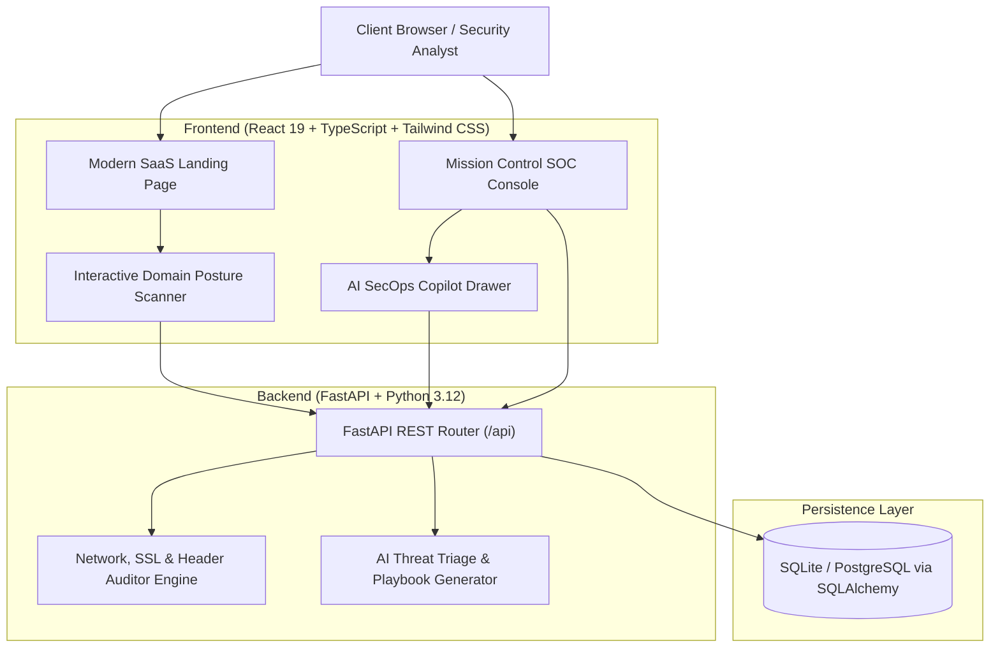

# 🛡️ AegisPulse AI — Autonomous SecOps & Threat Intelligence Platform

> **Autonomous Attack Surface Intelligence & AI Threat Triage for Growing Teams.**  
> Protect your infrastructure before threats become incidents. AegisPulse continuously scans external attack surfaces, identifies CVE vulnerabilities, and generates 1-click AI remediation playbooks.

[](https://python.org)
[](https://fastapi.tiangolo.com)
[](https://react.dev)
[](https://www.typescriptlang.org)
[](https://tailwindcss.com)
[](https://docker.com)

---

## 📌 Executive Architecture



---

## 🚀 Key Capabilities

### 1. 🔍 Zero-Agent External Attack Surface Scanner
- Audits any public domain or IP in real time.
- Validates TLS certificate chain, cipher strength, and expiration timelines.
- Verifies defensive HTTP response headers (`HSTS`, `CSP`, `X-Frame-Options`, `X-Content-Type-Options`).
- Probes exposed administrative and operational ports (`80`, `443`, `22`, `8080`).
- Computes an objective 0–100 Security Posture Score with letter grades (`A+` to `F`).

### 2. ⚡ Live Mission Control SOC Dashboard
- High-density security operations center console with 4 real-time KPI metrics.
- Active threat and incident feed categorized by severity (`CRITICAL`, `HIGH`, `MEDIUM`, `LOW`).
- Live "+ Simulate Threat" trigger to inject realistic zero-day and brute-force telemetry events.
- Monitored assets manager tracking cloud VPS, API gateways, database clusters, and DNS roots.
- 1-click export of continuous SOC 2 and ISO 27001 compliance audit reports.

### 3. 🧠 Autonomous AI Threat Copilot
- Clicking any incident generates an instant executive briefing for leadership.
- Provides CVSS risk scoring and technical attack vector root-cause analysis.
- Generates verified, copy-pasteable 1-click remediation scripts in **Bash**, **PowerShell**, or **Cloudflare WAF** JSON rules.
- Tracks resolution workflow: mark incident resolved and quarantine compromised assets.

---

## 🛠️ Monorepo Structure

```text
aegispulse-ai/
├── frontend/                     # React + Vite + TypeScript + Tailwind CSS
│   ├── src/
│   │   ├── components/           # Navbar, Hero, Scanner, Dashboard, CopilotDrawer, Pricing
│   │   ├── services/             # API client with resilient fallback engine
│   │   ├── types/                # TypeScript interfaces
│   │   ├── App.tsx               # Main application controller
│   │   └── index.css             # Tailwind v4 styles + custom cyber aesthetic
│   ├── package.json
│   └── vite.config.ts
│
├── backend/                      # Python FastAPI application
│   ├── app/
│   │   ├── api/                  # Endpoints (/health, /scan, /incidents, /copilot)
│   │   ├── database/             # SQLAlchemy engine & sessionmaker
│   │   ├── models/               # Database tables (Incident, Asset, ScanReport)
│   │   ├── schemas/              # Pydantic validation schemas
│   │   ├── services/             # Scanner auditor & AI triage engine
│   │   └── main.py               # Application entrypoint & CORS config
│   ├── requirements.txt
│   └── Dockerfile
│
├── docker-compose.yml            # 1-Command full-stack container orchestration
├── start-all.ps1                 # Unified Windows launch script
└── README.md
```

---

## ⚡ Quickstart Guide

### Option A: 1-Click Launch (Windows)
Run the automated launcher script from PowerShell:
```powershell
.\start-all.ps1
```
- **Frontend App:** [http://localhost:5173](http://localhost:5173)
- **FastAPI Interactive Docs:** [http://127.0.0.1:8000/docs](http://127.0.0.1:8000/docs)

---

### Option B: Manual Setup

#### 1. Backend (FastAPI)
```powershell
cd backend
py -m pip install -r requirements.txt
py -m uvicorn app.main:app --host 127.0.0.1 --port 8000 --reload
```

#### 2. Frontend (React + Vite)
```powershell
cd frontend
npm install
npm run dev
```

---

### Option C: Docker Compose
```bash
docker compose up --build
```

---

## 📡 REST API Reference

| Method | Endpoint | Description |
|---|---|---|
| `GET` | `/api/health` | Service health status and timestamp |
| `POST` | `/api/scan` | Audit domain network, TLS, headers, and ports |
| `GET` | `/api/incidents` | Retrieve list of security incidents and active CVEs |
| `POST` | `/api/incidents` | Ingest new security telemetry alert |
| `PUT` | `/api/incidents/{id}/status` | Update incident resolution state |
| `GET` | `/api/assets` | Retrieve monitored infrastructure endpoints |
| `POST` | `/api/copilot/triage` | Generate AI executive summary & remediation scripts |

---

## 🌐 Production Deployment

### 1. Frontend &rarr; Vercel / Netlify
1. Connect your GitHub repository to [Vercel](https://vercel.com).
2. Set Root Directory to `frontend`.
3. Build Command: `npm run build`
4. Output Directory: `dist`

### 2. Backend &rarr; Render / Railway / Azure
1. Deploy `backend` as a Web Service on [Render](https://render.com) or [Railway](https://railway.app).
2. Start Command: `uvicorn app.main:app --host 0.0.0.0 --port $PORT`
3. Environment: Python 3.12+

### 3. Database &rarr; Managed PostgreSQL
1. Create a free PostgreSQL instance on [Neon](https://neon.tech) or [Supabase](https://supabase.com).
2. Update `DATABASE_URL` in `app/database/session.py` to point to your Postgres connection string.

---

## 📄 License
MIT License. Built for cybersecurity engineers and high-velocity infrastructure teams.
